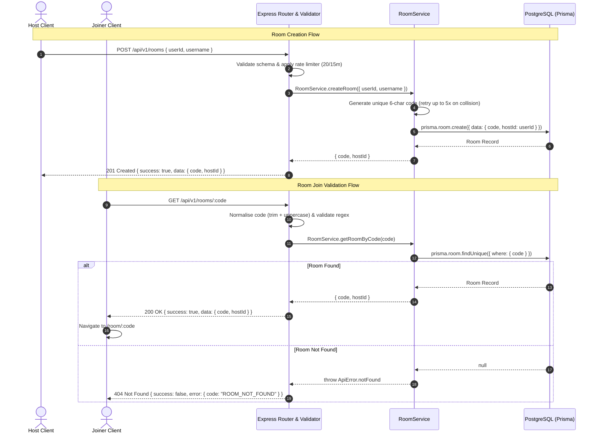

# Room Lifecycle

## What
The Room Lifecycle covers the creation and retrieval of synchronized watch party rooms. Rooms are identified by an uppercase 6-character alphanumeric code (excluding ambiguous characters `0, O, 1, I`) and track the host identity and creation timestamp.

## Why
- **Simplicity**: Short 6-character room codes (`ABCDEFGHJKLMNPQRSTUVWXYZ23456789`) are easily shared via chat, link, or email.
- **Single Source of Truth**: Room metadata is persisted in PostgreSQL to ensure room existence and host ownership survive server restarts.
- **Layered Architecture**: Adheres to strict unidirectional data flow (`route` -> `validator` -> `controller` -> `service` -> `Prisma`) preventing leaky abstractions.

## How

### Flow Diagram

### Guest Identity & Stage 4 Auth
Currently, client requests pass a guest identity `{ userId, username }` generated on first visit and stored in `localStorage`. 

> [!IMPORTANT]
> **TODO(stage-4)**: In Stage 4 (Auth), the `hostId` and `userId` will come exclusively from verified JWT authentication tokens (`req.user.id`), never from client-supplied request bodies (adhering to **AUTH-06**).

### Single-Instance Note
The platform operates on a single-instance model (Railway/Render) without Redis adapters. Persistent room metadata (`id`, `code`, `hostId`) is stored in PostgreSQL. In-memory room state (participants, active video, sync position) will be rebuilt lazily upon the first client join event following a server restart.

## Cross References
- [Setup & Getting Started](../1-getting-started/setup.md)
- [Home Page Component](../3-components/home-page.md)
- [RBAC System](rbac.md)
