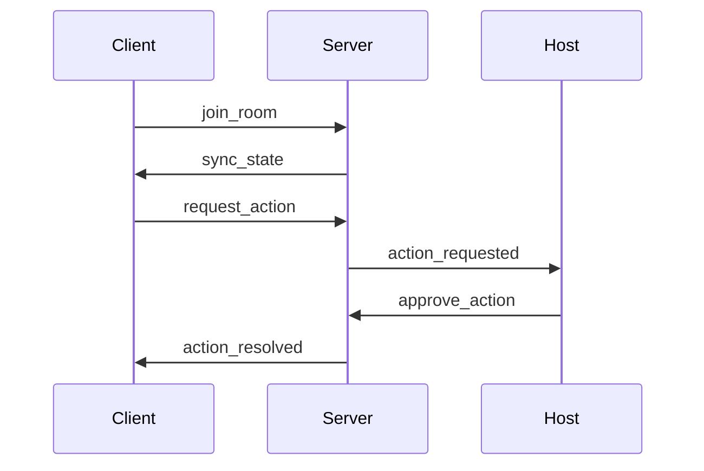

# Socket Events

## Events Table
| Event | Direction | Payload | Notes |
|---|---|---|---|
| `join_room`, `leave_room` | C->S | `{roomId}` | 6-char `roomId` only |
| `play`, `pause`, `seek`, `change_video` | C->S | (Video controls) | |
| `assign_role`, `remove_participant`, `transfer_host` | C->S | (Role management) | |
| `chat_message` | C->S | `{text}` | Max 500 chars |
| `request_action` | C->S | `{type, payload}` | Expires in 60s, max 1 pending/user |
| `approve_action`, `reject_action` | C->S | `{requestId}` | |
| `sync_state` | S->C | `{playState, currentTime, videoId}` | |
| `user_joined`, `user_left`, `role_assigned`, `participant_removed`, `host_transferred` | S->C | (Room updates) | |
| `action_requested` | S->C | `{requestId, userId, type, payload}` | Sent to Host/Mods |
| `action_resolved` | S->C | `{requestId, status, userId, type}` | Sent to room |
| `error` | S->C | - | |

## Flow Diagram

