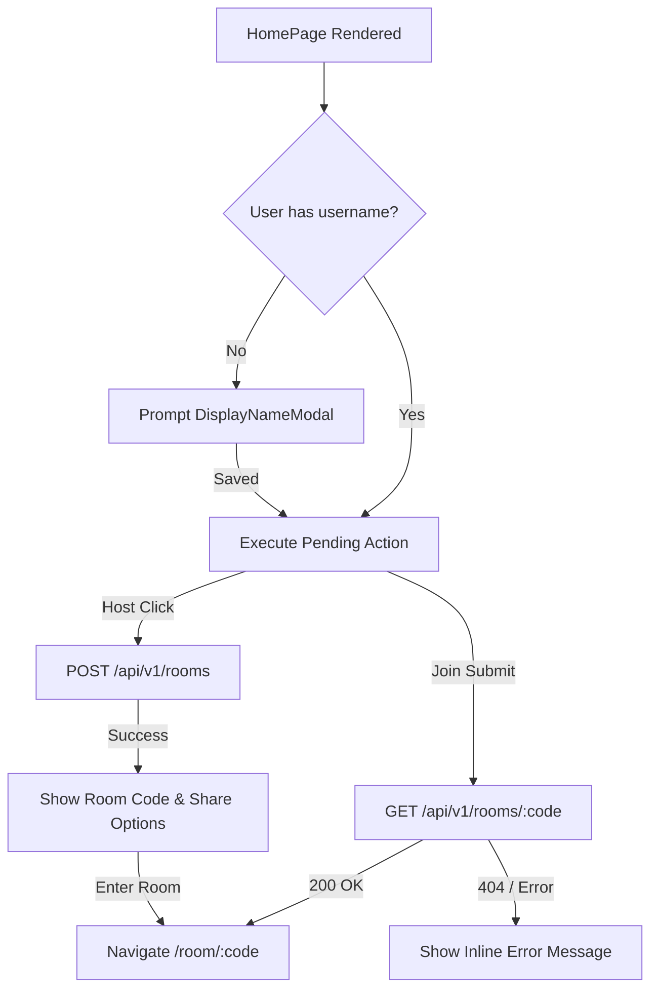

# Home Page Component

## Domain
Frontend / Client Application / Entry Point

## Source Code
- [`client/src/pages/HomePage.tsx`](file:///d:/Work/Web3task%20Assignment/client/src/pages/HomePage.tsx)
- [`client/src/api/rooms.api.ts`](file:///d:/Work/Web3task%20Assignment/client/src/api/rooms.api.ts)
- [`client/src/components/ui/DisplayNameModal.tsx`](file:///d:/Work/Web3task%20Assignment/client/src/components/ui/DisplayNameModal.tsx)

## Overview
The `HomePage` component is the primary landing view for WatchParty. It provides two side-by-side action cards:
1. **Host a Room**: Initiates room creation via `POST /api/v1/rooms`. Upon creation, the card dynamically displays the 6-character room code with actions to Copy Code, Copy Link, Invite by Email (`mailto:`), and Enter Room.
2. **Join a Room**: Validates and joins an existing room via `GET /api/v1/rooms/:code`. Auto-uppercases inputs, enforces the 6-character alphabet client-side, and displays inline validation/404 errors.

Before either action executes, if the user does not have a saved display name, the `DisplayNameModal` is automatically presented to require a 2–24 character username.

## Handoff Diagram

## Integrations
- [`AppShell`](nav-rail.md) layout wrapper.
- `useCurrentUser()` hook for guest identity and reactive display name updates.
- REST API layer (`api/rooms.api.ts`).

## Gotchas
- **Copy Feedback**: Clipboard write permissions can fail in unsecure contexts; fallbacks and timers (2s) reset gracefully.
- **Form Auto-Submission**: The room code input automatically converts characters to uppercase and strips invalid characters (`0, O, 1, I`) as typed.
