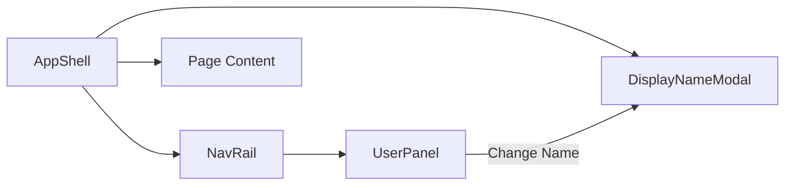

# Nav Rail & AppShell Component

## Domain
Frontend / Client Application / Layout & Navigation

## Source Code
- [`client/src/components/layout/AppShell.tsx`](file:///d:/Work/Web3task%20Assignment/client/src/components/layout/AppShell.tsx)
- [`client/src/components/layout/NavRail.tsx`](file:///d:/Work/Web3task%20Assignment/client/src/components/layout/NavRail.tsx)
- [`client/src/components/layout/UserPanel.tsx`](file:///d:/Work/Web3task%20Assignment/client/src/components/layout/UserPanel.tsx)

## Overview
`AppShell` provides the main responsive wrapper for top-level pages. It features:
- **`NavRail`**: A slim icon rail on desktop (`md:` and above) displaying the brand logo mark, a Home navigation button, and a pinned `UserPanel` at the bottom. Under the `md` breakpoint, it transitions into a sticky bottom navigation bar.
- **`UserPanel`**: Displays the active user's display name, a shortened user ID with a copy-to-clipboard button, and an action to reopen the `DisplayNameModal` for editing.
- **`DisplayNameModal`**: An accessible dialog with keyboard focus trapping and escape key constraints (can only be dismissed if a valid name already exists).

## Handoff Diagram

## Integrations
- React Router DOM (`NavLink`, `useLocation`).
- `useCurrentUser()` identity hook.

## Gotchas
- **Mobile Viewport Spacing**: Content inside `AppShell` includes bottom padding (`pb-20 md:pb-0`) to prevent mobile bottom rail occlusion.
- **Modal Focus Restoration**: `DisplayNameModal` saves and restores focus to the trigger element when closing.
